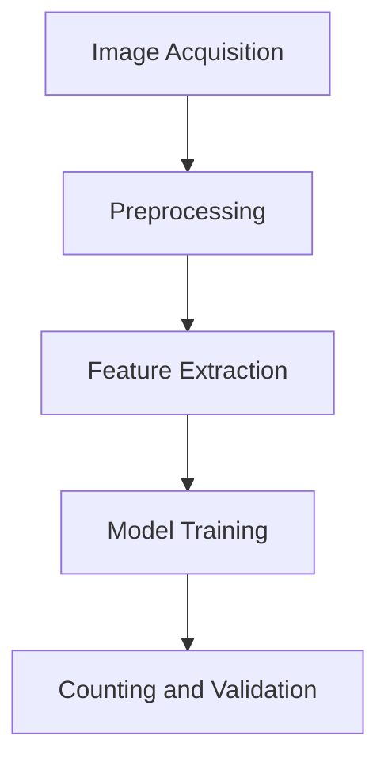
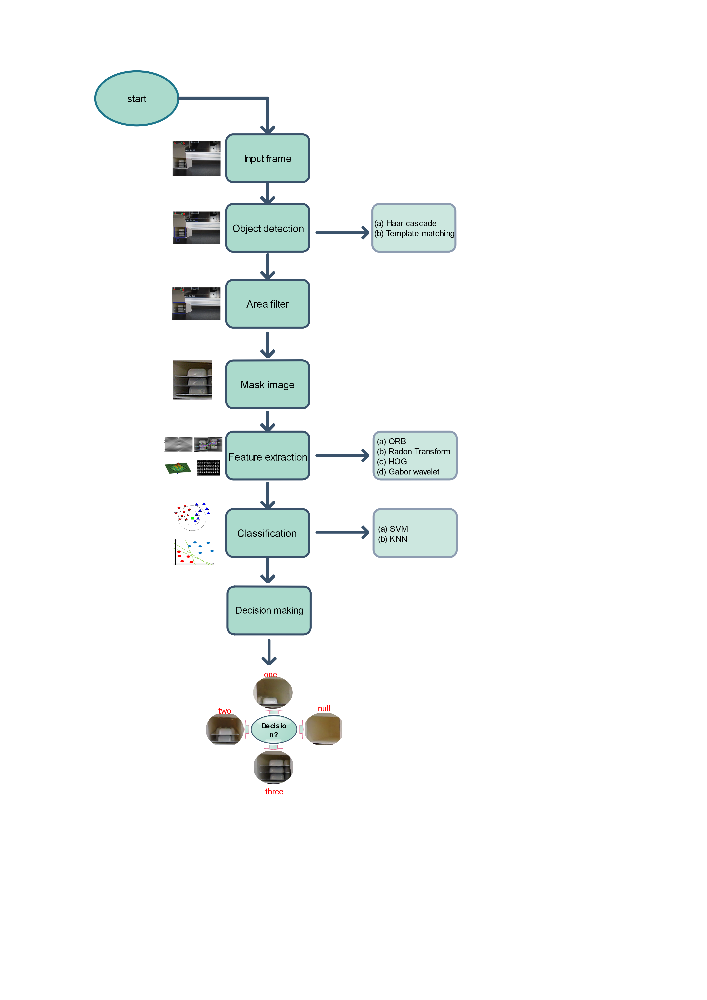
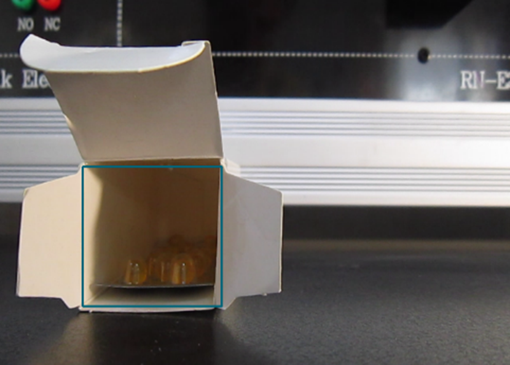
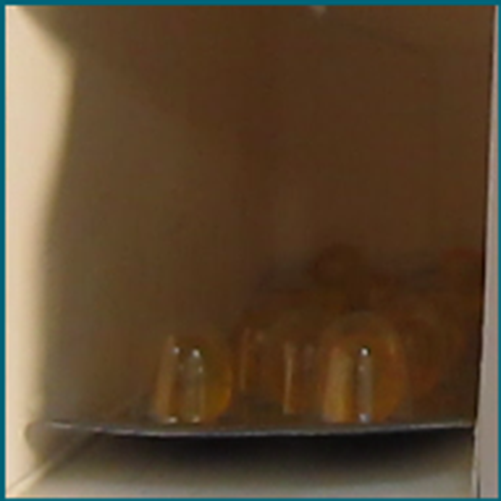

# A Machine Learning-Based Approach for Counting Blister Cards Within Drug Packages

This repository implements the methodology described in our paper:

> Bahaghighat, Mahdi, Leila Akbari, and Qin Xin. "A machine learning-based approach for counting blister cards within drug packages." IEEE Access 7 (2019): 83785-83796. 

## Overview
Counting blister cards within drug packages is a crucial task in pharmaceutical industries to ensure packaging accuracy and efficiency. Our approach leverages machine learning and image processing techniques to provide a reliable and scalable solution for this task.

### Key Features:
- **Automated Counting**: Uses a machine learning model to accurately count blister cards in complex scenarios.
- **Scalable Design**: Capable of handling various types and shapes of drug packages.
- **Open Source**: Freely available for research and educational purposes.

## Methodology
The workflow consists of the following steps:

1. **Image Acquisition**: Capturing high-resolution images of the drug packages.
2. **Preprocessing**: Enhancing image quality and reducing noise.
3. **Feature Extraction**: Extracting features such as edges and contours to identify individual blister cards.
4. **Model Training**: Training a machine learning model to distinguish and count blister cards.
5. **Validation**: Testing the model on unseen data to ensure accuracy.

### System Workflow
Below is the block diagram illustrating the process:



## Installation
To set up the environment and run the project:

1. Clone this repository:
   ```bash
   git clone https://github.com/username/blister-card-counting.git
   cd blister-card-counting
   ```

2. Install dependencies:
   ```bash
   pip install -r requirements.txt
   ```

3. Download the dataset (link provided in the paper or repository).

## Usage
To perform blister card counting, run the following command:

```bash
python count_blister_cards.py --image_path /path/to/image
```
## block diagram


### Example
Input:



Output:



## Results
The proposed method achieves high accuracy on diverse datasets, as detailed in the paper:

- **Accuracy**: 98.5%
- **Processing Time**: Average 0.5 seconds per image

## Citation
If you find this repository useful in your research or work, please cite the following paper:

```latex
@article{bahaghighat2019machine,
  title={A machine learning-based approach for counting blister cards within drug packages},
  author={Bahaghighat, Mahdi and Akbari, Leila and Xin, Qin},
  journal={IEEE Access},
  volume={7},
  pages={83785--83796},
  year={2019},
  publisher={IEEE}
}
```

## License
This project is licensed under the MIT License. See the LICENSE file for details.

## Contact
For questions or collaborations, please contact:

- **Leila Akbari**: leila.akbari@qiau.ac.ir
- **GitHub**: ([https://github.com/leila-akbari](https://github.com/leila4793))

---

Thank you for your interest in our work!
